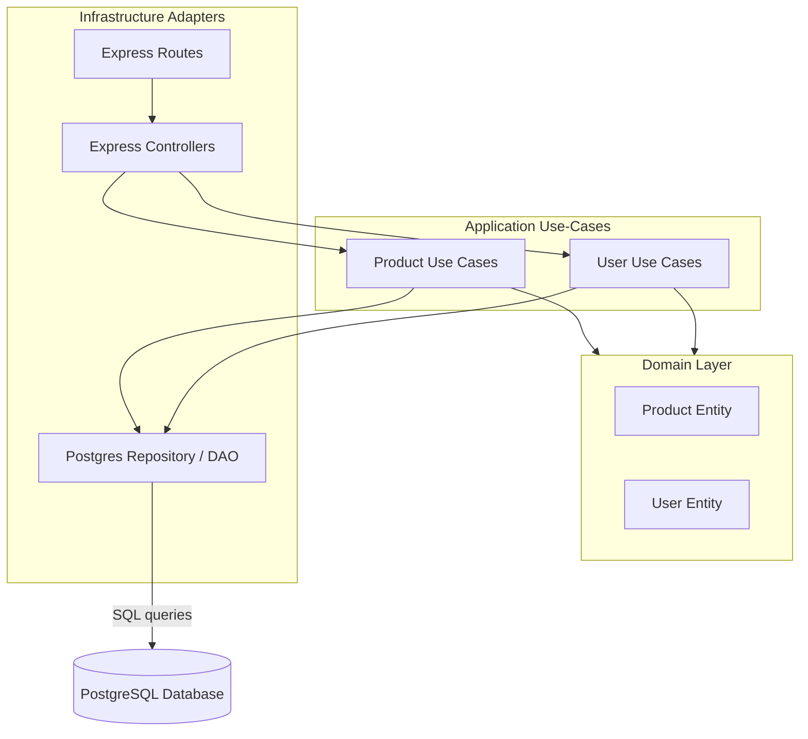

# Modsy: Premium Modular Furniture Ecosystem

Modsy is a next-generation digital e-commerce and operations platform designed for premium customizable modular furniture. Built as a high-performance single-source ecosystem, it serves both retail consumers (via an engaging storefront) and corporate staff/administrators (via a robust internal intranet and inventory dashboard).

---

## 🚀 Business Concept & Pitch
Modern commercial and residential spaces demand high adaptability, premium quality, and ergonomic excellence. Traditional furniture retailers suffer from rigid designs and disjointed inventory portals. 
**Modsy solves this by offering:**
*   **Highly Curated Premium Categories**: Ranging from ergonomic office systems to weather-resistant outdoor lounge sets.
*   **The Modular Advantage**: Every item is cataloged to support customizable scaling, catering to growing businesses and luxury homeowners alike.
*   **Integrated Intranet Operations**: Staff and union representatives manage the workspace, log working shifts, view wage calculators, and interact with administration from a unified portal.

---

## 🛠️ Technology Stack
*   **Database**: PostgreSQL (Supabase relational host) with structured tables for users, products, orders, order items, and persistable user cart registries.
*   **Backend Server**: Node.js & Express.js written in **TypeScript** using modular routing.
*   **Frontend**: Native HTML5, modern vanilla CSS3 (utilizing CSS Variables for flexible theming), and vanilla ES6+ JavaScript.
*   **Deployment**: Frontend hosted on Vercel, Backend hosted on Render with automatic Docker integration.

---

## 🏛️ Technical Architecture
The backend is structured according to **Hexagonal Architecture (Ports and Adapters)** to decouple domain logic from specific framework implementations:

### Key Modules:
*   **Entities**: Domain definitions ([Product.ts](file:///home/john/Documentos/proyecto-final-dam/backend/src/domain/entities/Product.ts)).
*   **Repositories (DAOs)**: Implement native SQL parameterized queries ([PostgresProductRepository.ts](file:///home/john/Documentos/proyecto-final-dam/backend/src/infrastructure/repositories/PostgresProductRepository.ts)).
*   **Database Connectivity**: Managed via a resilient PostgreSQL client pool with automatic connection timeouts and retries ([db.ts](file:///home/john/Documentos/proyecto-final-dam/backend/src/infrastructure/config/db.ts)).
*   **Security & Auth**: Password hashing via Bcrypt, session authorization via JSON Web Tokens (JWT), and role-based route guards (Client, Admin, Worker).
*   **Frontend Integration**: A centralized HTTP adapter utilizing the Fetch API ([api-services.js](file:///home/john/Documentos/proyecto-final-dam/assets/js/api-services.js)) with seamless localStorage fallbacks for offline testing.

---

## 📁 Key Features (Storefront & Intranet)
1.  **Premium Storefront**: Pinterest-style dynamic product masonry catalog with responsive grid columns, real-time search filtration, and persistent shopping cart.
2.  **User Authentication**: Dual-column sign-in/registration screen with dynamic cover panels and JWT validation.
3.  **Administrator Dashboard**: Real-time sales telemetry, automated revenue counting, paginated stock inventory controls (Add, Edit, Delete with instant SQL persistence).
4.  **Operational Intranet**:
    *   **Labor rights board** (Spanish worker legislation & collective agreements).
    *   **Employee shift registers** (Clock-in / Clock-out interactive logger).
    *   **Wage simulator** (Real-time net monthly salary calculator based on Spanish tax tiers).
    *   **Suggestion box** (Anonymous encrypted mailbox sending feedback directly to staff representatives).

---

## 📈 Future Enhancements
*   **Stripe Payment Gateway**: Transitioning simulated checkout sessions into a real-world merchant gateway.
*   **Augmented Reality (AR) Previews**: Allowing users to visualize modular furniture sizing in their workspace using smartphone cameras.
*   **Predictive Stock Refills**: AI-powered notifications recommending stock acquisitions based on user search trends.
*   **Real-time Shift Scheduling**: Integrating worker shifts with administrative resource planning.

---

## 🧩 Challenges & Resolutions
*   **Vercel Routing Glitches**: In development, folders were mirrored. This caused some links to point to empty subfolders. We resolved this by standardizing relative URLs and cleaning up redundant path prefixes in the client-side router (`navbar-updater.js`).
*   **PostgreSQL UUIDs**: Converting MongoDB-based string IDs to strict Postgres UUIDs caused initial query failures. We resolved this by implementing strict regex checking at the DAO level and cleaning database seed scripts to ensure correct format validation.
